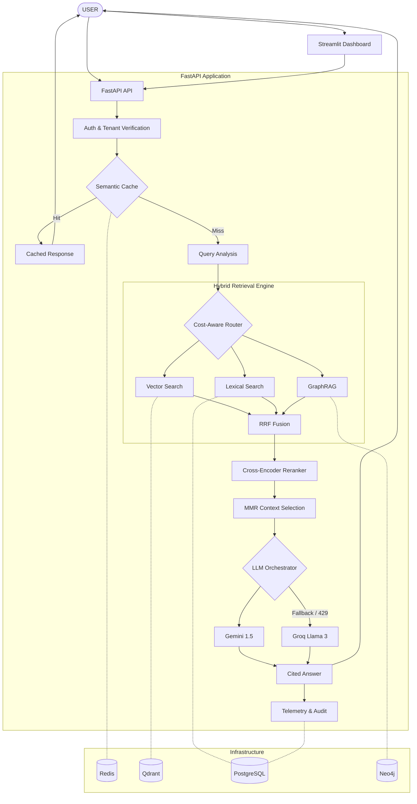

# RAGX Architecture

RAGX is a production-oriented, multi-tenant hybrid Retrieval-Augmented Generation (RAG) system built to address the limitations of standard vector-search chatbots.

## High-Level Architecture Flow

## Technology Stack

| Layer | Technology |
|---|---|
| **API** | FastAPI |
| **UI** | Streamlit |
| **Language** | Python 3.12 |
| **Embeddings** | Sentence Transformers (`all-MiniLM-L6-v2`) |
| **Vector DB** | Qdrant |
| **Lexical Retrieval** | BM25 (PostgreSQL Full-Text Search) |
| **Graph DB** | Neo4j |
| **Reranking** | Cross-Encoder (`ms-marco-MiniLM-L-6-v2`) |
| **Semantic Cache** | Redis |
| **Relational DB** | PostgreSQL |
| **Primary LLM** | Google Gemini (1.5 Flash) |
| **Fallback LLM** | Groq (Llama 3) |
| **Containerization** | Docker |
| **Orchestration** | Docker Compose |
| **Testing** | Pytest, Pytest-Asyncio |

## Core System Components

### 1. Multi-Tenant Security & Authentication
All endpoints enforce strict RBAC and tenant isolation using JWTs. The isolation is enforced at the database layer: Qdrant payload filters, Neo4j label matches, and PostgreSQL Row-Level Security equivalents to guarantee users never retrieve chunks belonging to other tenants.

### 2. Hybrid Retrieval
Instead of relying solely on vector search, RAGX executes multiple retrievers in parallel:
- **Dense Vector Search**: Identifies semantic similarity.
- **Sparse Lexical Search**: Identifies exact keyword matches (vital for IDs, names, and codes).
- **Graph Search (GraphRAG)**: Extracts structured relationships between entities.
Results are merged using **Reciprocal Rank Fusion (RRF)**.

### 3. Production Reranking & Context Selection
The initial retrieval retrieves a wide net of context. RAGX reranks these using a Cross-Encoder to compute actual relevance scores, and then applies **Maximal Marginal Relevance (MMR)** to ensure the LLM receives diverse, non-redundant context.

### 4. Semantic Cache & Cost-Aware Routing
Before querying the LLM, RAGX calculates the semantic similarity of the query against a Redis-backed semantic cache. If a highly similar query was recently asked, it returns the cached answer instantly. Furthermore, a Cost-Aware Router uses query complexity rules to determine if a query requires LLM generation at all, or if it can be satisfied by raw retrieval alone.

### 5. Resilient LLM Orchestration
The system utilizes a Circuit Breaker pattern. If the primary LLM (Gemini) fails or returns a `429 RESOURCE_EXHAUSTED` due to rate limits, RAGX immediately opens the circuit and falls back to a secondary provider (Groq) without disrupting the user experience.
